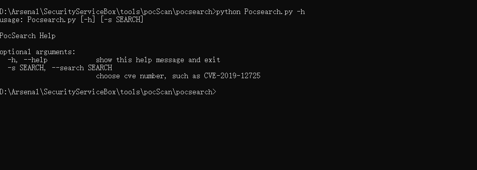
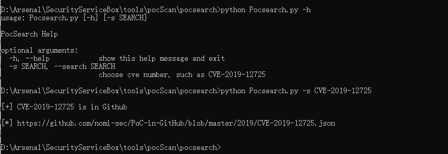

# Pocsearch

目的在于本地查询PoC-in-Github项目

`https://github.com/nomi-sec/PoC-in-GitHub`

## 2022.5 更新

将年份和编号合并，不需分开给定，集成到新项目服务盒子[SecurityServiceBox(](https://github.com/givemefivw/SecurityServiceBox)里面

## 使用截图

脚本使用很简单，指定CVE年份和CVE编号即可查询，网络不同的情况下需要挂上梯子。查询到之后直接访问链接即可。

